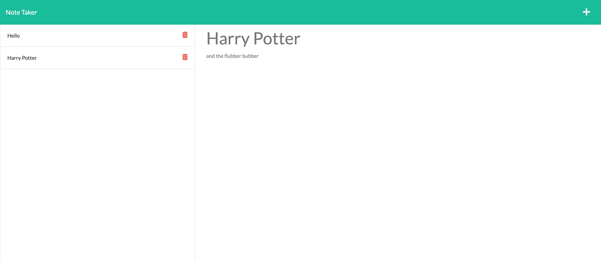

# Note-Taker

## Table of Content
* [Description](#description)
* [Instructions](#instructions)
* [Visuals](#visuals)
* [Links](#links)
* [Roadmap](#roadmap)
* [Contributing](#contributing)
* [Support](#support)
* [License](#license)

## Description
Take and keep track of your notes and reminders! 

## Instructions
Hit the + symbol at the top right of the screen. It will bring up a new note for you to enter in a title and description. Once you have written your note hit the save button. Your notes will be stored the left hand side of the screen. If you want to view the note simply click on that note to view it. 

If you are adding to the code please make sure you have the dependencies installed via npm install in the terminal. 

## Visuals

## Links
GitHub: https://github.com/Cannaestia/Note-Taker
Live Link: 

## Roadmap
- finalize the delete button to work

## Contributing
Jennifer Arnold

## Suppport
Send support ticket to:
- Cannaestia@gmail.com

## License 
MIT License

Copyright (c) [2022] [Note-Taker]

Permission is hereby granted, free of charge, to any person obtaining a copy of this software and associated documentation files (the "Software"), to deal in the Software without restriction, including without limitation the rights to use, copy, modify, merge, publish, distribute, sublicense, and/or sell copies of the Software, and to permit persons to whom the Software is furnished to do so, subject to the following conditions:

The above copyright notice and this permission notice shall be included in all copies or substantial portions of the Software.

THE SOFTWARE IS PROVIDED "AS IS", WITHOUT WARRANTY OF ANY KIND, EXPRESS OR IMPLIED, INCLUDING BUT NOT LIMITED TO THE WARRANTIES OF MERCHANTABILITY, FITNESS FOR A PARTICULAR PURPOSE AND NONINFRINGEMENT. IN NO EVENT SHALL THE AUTHORS OR COPYRIGHT HOLDERS BE LIABLE FOR ANY CLAIM, DAMAGES OR OTHER LIABILITY, WHETHER IN AN ACTION OF CONTRACT, TORT OR OTHERWISE, ARISING FROM, OUT OF OR IN CONNECTION WITH THE SOFTWARE OR THE USE OR OTHER DEALINGS IN THE SOFTWARE.